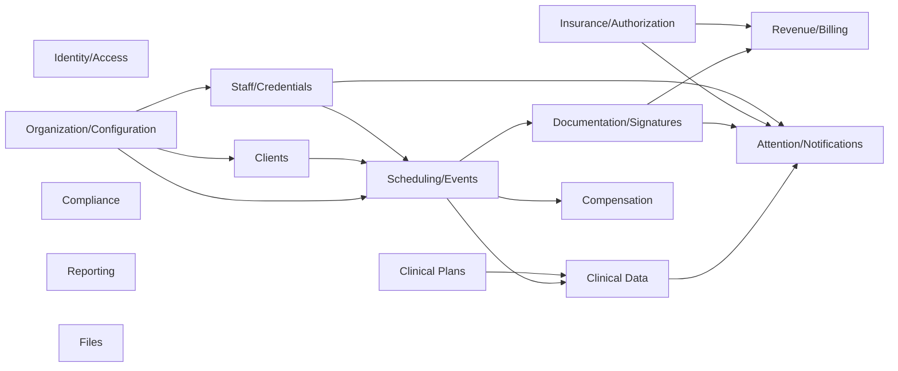

# API and Domain Boundaries V1

Phase 17 deliverable; **hardened in Phase 17.1**. Backend module boundaries
and API responsibility. **Not** an exhaustive endpoint catalog.

Style: modular monolith; modules own writes; cross-module reads allowed;
cross-module writes only through published application services / explicit
invariants. Tenant-owned writes must preserve organization-consistent
composite FKs; mutable writes must honor `row_version` concurrency.

---

## Boundary map

---

## 1. Identity / Access

| | |
|---|---|
| **Source-of-truth entities** | UserIdentity, UserSession, OrganizationMembership (auth slice), OperationalFunction, FunctionGrant (incl. `scope_mode`) |
| **Writes owned** | Register/login/logout; session revoke; grant/revoke Functions + scope_mode; membership auth status |
| **Reads depended on** | UserCredential (for Ceiling derivation at authz time); ClientAssignment (only when grant scope is ASSIGNED_CLIENTS) |
| **Cross-domain invariants** | One login per human; Function grants never raise Clinical Authority Ceiling; `ORGANIZATION` scope changes WHERE authority applies, never WHAT Ceiling allows; Terminated membership revokes sessions |

---

## 2. Organization / Configuration

| | |
|---|---|
| **Source-of-truth entities** | Organization, EventType, Service, BillingCode, Payer, HealthPlan, PayerReimbursementRate, BillingEntity, ClearingHouseConfiguration, PayerPlanBillingEntityRole, FinancialDocumentLockPolicy, CredentialDefinition, ClinicalDocumentTemplate, RequiredDocumentPolicy, eligibility joins, org work hours |
| **Writes owned** | All Layer-1 catalogs, billing-entity/clearinghouse **configuration**, financial lock policy, org profile |
| **Reads depended on** | None critical (root) |
| **Cross-domain invariants** | Services do not nest inside Service Plan Category→Program tree; EventType billing-code allow-lists are hard constraints for Scheduling; guided config dependency order must be expressible; ClearingHouseConfiguration is integration config only (no native clearinghouse network); PayerReimbursementRate ≠ ProviderRate |

---

## 3. Clients

| | |
|---|---|
| **Source-of-truth entities** | Client, Caregiver, ConsentAuthority, Diagnosis, Physician |
| **Writes owned** | Client CRUD/lifecycle; caregiver/consent/diagnosis/physician |
| **Reads depended on** | Organization; Files (photo) |
| **Cross-domain invariants** | Inactive/Discharged block new scheduling/delivery; Discharged resumption = explicit audited reactivation (no Episode entity in V1); never hard-delete clinical history; consent fields are first-class |

---

## 4. Staff / Credentials

| | |
|---|---|
| **Source-of-truth entities** | OrganizationMembership (HR/employment slice), UserCredential, CredentialBillingCodeEligibility (with Config) |
| **Writes owned** | Staff profile; employment type; credential attach/renew/expire; staff lifecycle |
| **Reads depended on** | CredentialDefinition catalog; UserIdentity |
| **Cross-domain invariants** | Employment Type is SSOT for compensation pathway; expired credential drops Ceiling and blocks gated scheduling; Terminated → session revoke via Identity |

---

## 5. Scheduling / Events

| | |
|---|---|
| **Source-of-truth entities** | Event, EventServiceDelivery, recurrence series metadata |
| **Writes owned** | Book/reschedule/cancel/approve; delivery units/codes on Event |
| **Reads depended on** | Client lifecycle; provider eligibility (Credentials/Assignments/Services/EventType); Insurance auto-fill inputs; PA policy flags |
| **Cross-domain invariants** | Cannot schedule Active delivery for Inactive/Discharged clients; provider eligibility all-gates; Approval ≠ documentation complete; clinical Event lock from Docs Reviewed; **financial** Event locks driven by FinancialDocumentLockPolicy (claim / client invoice / provider invoice / timesheet independently) |

---

## 6. Clinical Plans

| | |
|---|---|
| **Source-of-truth entities** | ServicePlan, Category, Program, Objective, Baseline, MeasurementDefinition, Program Library templates |
| **Writes owned** | Plan/program/objective/baseline authoring; manual mastery status |
| **Reads depended on** | Client; optional Service name-match from Config |
| **Cross-domain invariants** | Category defaults copied then decoupled; mastery never auto from criteria; clinical writes Ceiling-gated |

---

## 7. Clinical Data

| | |
|---|---|
| **Source-of-truth entities** | RawObservation, Datasheet |
| **Writes owned** | Observation entry/edit; Datasheet status transitions |
| **Reads depended on** | Programs/Objectives; Event; author identity |
| **Cross-domain invariants** | Author attribution automatic; Reviewed/Locked Datasheet hard-blocks normal edits; amendments auditable |

---

## 8. Documentation / Signatures

| | |
|---|---|
| **Source-of-truth entities** | ClinicalDocument, ClinicalDocumentTemplate usage, DocumentEventLink, Signature, RequiredDocumentInstance (runtime) |
| **Writes owned** | Document lifecycle; links; signatures; required-doc instance status (admin Function) |
| **Reads depended on** | Event, Client, Plans; RequiredDocumentPolicy; Membership (HR required docs) |
| **Cross-domain invariants** | Five-entity split respected; Reviewed locks document + linked Event; Signature uses event_id XOR clinical_document_id FKs; RequiredDocumentInstance uses client_id XOR membership_id; Signature independent of status transition; Files module isolated from Documentation |

---

## 9. Insurance / Authorization

| | |
|---|---|
| **Source-of-truth entities** | InsuranceCoverage, CoordinationOfBenefits, ClientInsuranceRateOverride, PriorAuthorization, AuthorizationAllocation, AuthorizationConsumption |
| **Writes owned** | Coverages, COB order, client insurance rate overrides, PA lifecycle, AuthorizationAllocation; **append-only** AuthorizationConsumption (CONSUME/REVERSAL/ADJUSTMENT) |
| **Reads depended on** | Client, Payer, HealthPlan, PayerReimbursementRate, BillingCode; Event signals |
| **Cross-domain invariants** | Multiple coverages with explicit COB order; PA requiredness policy-driven; used/remaining units are **derived from consumption ledger** (never manually mutable SoT); duplicate Event CONSUME blocked by uniqueness; corrections via REVERSAL not silent mutation; Billing Readiness reads derived remaining |

---

## 10. Revenue / Billing

| | |
|---|---|
| **Source-of-truth entities** | Claim, ClaimItem, ClientInvoice, Remittance; reads BillingEntity / ClearingHouseConfiguration / PayerPlanBillingEntityRole / FinancialDocumentLockPolicy from Configuration |
| **Writes owned** | Claim and ClientInvoice generation/status; remittance import/reconcile |
| **Reads depended on** | Billing Readiness evaluator inputs (Docs, Signatures, Event, PA derived remaining, eligibility, locks); Insurance/COB; rate resolution (override > plan rate) |
| **Cross-domain invariants** | Readiness is evaluated, not a stored boolean SoT; ClientInvoice structurally ≠ ProviderInvoice; Claim/ClientInvoice Event locks obey FinancialDocumentLockPolicy (not hard-coded accidents); payer reimbursement ≠ provider compensation; clearinghouse **transmission** is integration — internal Claim + ClearingHouseConfiguration records remain first-class |

**Billing Readiness** lives as a shared domain service used by this module (and UI badges), implemented alongside Documentation/Events/Insurance reads.

---

## 11. Compensation

| | |
|---|---|
| **Source-of-truth entities** | ProviderRate, Timesheet, ProviderInvoice, PaymentProfile |
| **Writes owned** | Provider rates; timesheet/provider-invoice generation; payment-profile metadata |
| **Reads depended on** | Membership.employment_type; Events; BillingCode; FinancialDocumentLockPolicy |
| **Cross-domain invariants** | Employee → Timesheet; Contractor → ProviderInvoice; ProviderRate must not contradict Employment Type; ProviderInvoice ≠ ClientInvoice; Event locks obey policy flags; PaymentProfile is payout **config only** — fund disbursement is integration |

---

## 12. Compliance

| | |
|---|---|
| **Source-of-truth entities** | None exclusive — rollup module |
| **Writes owned** | None required (may write AttentionCoordination via Attention module) |
| **Reads depended on** | RequiredDocumentInstance, PriorAuthorization, UserCredential, ClinicalDocument |
| **Cross-domain invariants** | Expiring union is derived; does not itself grant clinical authority |

---

## 13. Attention / Notifications

| | |
|---|---|
| **Source-of-truth entities** | AttentionCoordination, NotificationHistory |
| **Writes owned** | Assign/ack/snooze/escalate metadata; notification records |
| **Reads depended on** | All domains’ evaluators/conditions |
| **Cross-domain invariants** | Source condition always re-derived; this module never performs clinical/financial resolving writes; ROUTE FOR CORRECTION ≠ CLINICAL REVIEW |

---

## 14. Reporting

| | |
|---|---|
| **Source-of-truth entities** | ReportDefinition (future); queries Activity/Audit |
| **Writes owned** | Saved report definitions only |
| **Reads depended on** | Everything (read-only) |
| **Cross-domain invariants** | Reports never expose clinical write actions; Activity feed ≠ AuditEntry |

---

## 15. Files

| | |
|---|---|
| **Source-of-truth entities** | StoredFile (+ object storage object) |
| **Writes owned** | Upload/delete metadata; storage I/O |
| **Reads depended on** | AuthZ for linked entity access |
| **Cross-domain invariants** | Isolated from Documentation lifecycle; no large blobs in PostgreSQL |

---

## Shared platform services (not domain modules)

| Service | Role |
|---|---|
| **AuthN middleware** | Session/token validation |
| **AuthZ engine** | Function (+ scope_mode) + Ceiling + Assignment + lifecycle |
| **Audit writer** | Append-only AuditEntry |
| **Readiness / Requirement evaluator** | Deterministic named-condition results (incl. derived PA remaining) |
| **Concurrency guard** | row_version conflict detection on mutable writes |
| **AI proxy** | Server-side Gemini (Sidekick/Toolkit/narratives) |

---

## Change Log

- **V1.1 (Phase 17.1):** Revenue entities (BillingEntity, ClearingHouse, rates, ClientInvoice, PaymentProfile, lock policy); PA consumption ledger; FunctionGrant.scope_mode; concurrency notes.
- **V1 (Phase 17):** Coherent module boundaries aligned to React Feature Map domains without microservices.
