# Target Technical Architecture V1

Phase 17 deliverable; **hardened in Phase 17.1**. Production architecture
**under and around** the existing `bcba-workspace-ai-studio` React application.

**Non-negotiable:** This is not a greenfield app. The existing React +
TypeScript SPA remains the product UI and is evolved in place.

---

## 1. Architecture style

**Modular monolith first.**

One deployable backend process exposes a versioned HTTP API. Domain logic
is partitioned into modules with clear ownership of writes. Shared kernel
concerns (authn, authz, tenancy, audit, files) are platform services used
by all modules.

**Rejected for this phase (no demonstrated requirement):** microservices,
Kubernetes-required topology, event buses as primary integration,
polyglot persistence, Firebase-style document DB as canonical store.

---

## 2. System context

```mermaid
flowchart TB
  subgraph Client["Web Application — bcba-workspace-ai-studio"]
    UI[React + TypeScript UI]
    LocalUX[Local UX state: undo buffer, drafts, filters]
    UI --> LocalUX
  end

  subgraph API["Modular Monolith Backend"]
    Gateway[HTTP API Gateway / Auth middleware]
    AuthZ[Authorization: Function + Ceiling + Scope]
    ModId[Identity / Access]
    ModOrg[Organization / Configuration]
    ModClient[Clients / Caregivers / Assignments]
    ModStaff[Staff / Credentials]
    ModSched[Scheduling / Events]
    ModClin[Clinical Plans / Data / Docs]
    ModRev[Insurance / PA / Billing / Claims]
    ModComp[Compensation]
    ModAttn[Attention / Notifications]
    ModAudit[Audit / Compliance]
    ModFiles[Files metadata]
    Eval[Requirement / Billing Readiness Evaluators]
    Jobs[Background jobs — mail, reminders, ERA import]
    Gateway --> AuthZ
    AuthZ --> ModId
    AuthZ --> ModOrg
    AuthZ --> ModClient
    AuthZ --> ModStaff
    AuthZ --> ModSched
    AuthZ --> ModClin
    AuthZ --> ModRev
    AuthZ --> ModComp
    AuthZ --> ModAttn
    AuthZ --> ModAudit
    AuthZ --> ModFiles
    ModClin --> Eval
    ModRev --> Eval
    ModAttn --> Eval
  end

  PG[(PostgreSQL — canonical relational truth)]
  OBJ[(Object Storage — binary files)]
  IdP[Identity Provider / password+session or OIDC]
  AI[AI Provider — Gemini, server-proxied]
  INT[Integrations — clearinghouse / payroll disbursement — future]

  UI -->|HTTPS JSON API| Gateway
  ModId --> IdP
  ModId --> PG
  ModOrg --> PG
  ModClient --> PG
  ModStaff --> PG
  ModSched --> PG
  ModClin --> PG
  ModRev --> PG
  ModComp --> PG
  ModAttn --> PG
  ModAudit --> PG
  ModFiles --> PG
  ModFiles --> OBJ
  ModClin --> AI
  Jobs --> PG
  ModRev -.->|boundary| INT
  ModComp -.->|boundary| INT
```



---

## 3. Layers

| Layer | Responsibility |
|---|---|
| **Web application** | Existing React product. Owns presentation, local interaction state, optimistic UX. Calls API for all durable truth. Gradually replaces direct `appState` + localStorage writes with API-backed repositories while keeping UI components. |
| **Backend / API** | Modular monolith. Authenticate every request. Authorize every protected write with Function + Clinical Authority Ceiling + Client scope. Enforce invariants. Emit audit entries. |
| **PostgreSQL** | Canonical store for all relational entities (see `POSTGRES_DOMAIN_MODEL_V1.md`). Multi-tenant via `organization_id` **plus database-level organization-consistent composite FKs**. Optimistic concurrency via `row_version` on mutable records. |
| **Object storage** | Binary files (uploads, generated PDFs, signature images if stored as files). Relational `StoredFile` metadata only in PostgreSQL. |
| **Background jobs** | Only where async is required: email/notification delivery, credential/PA expiration digests, remittance import, large export generation. Not for core clinical writes. |
| **AI boundary** | Server-side proxy of Gemini (or successor). Keys never in the browser for production. Grounding rules from current `geminiService` preserved. |

---

## 4. Multi-tenancy

- **Organization (Clinic)** is the tenant root.
- Every tenant-owned row carries `organization_id`.
- Requests resolve active Organization Membership for the authenticated User Identity.
- Cross-tenant access is denied by application scoping **and** by composite FK constraints that prevent cross-org relationship edges (see domain model §0.1).
- Organization-wide vs assigned-client access is modeled by `FunctionGrant.scope_mode` (`ORGANIZATION` \| `ASSIGNED_CLIENTS`), not by a flag on `ClientAssignment`.

---

## 5. Authentication

- One human = one User Identity = one login.
- Session-based or token-based auth with server-side session store.
- Password hashes (or OIDC) — never plaintext.
- **Session revocation** supported (staff Terminated, security incident, admin logout-device).
- Membership in an Organization is required before any clinic data access.

---

## 6. Authorization enforcement

UI `PermissionGate` may hide controls. **UI hiding is never sufficient.**

Every protected write path on the backend evaluates:

1. Authenticated User Identity
2. Active Organization Membership
3. Operational Function grant(s) for the verb domain
4. Clinical Authority Ceiling (credential-derived) when verb is clinical
5. FunctionGrant.scope_mode: if `ASSIGNED_CLIENTS`, require ClientAssignment; if `ORGANIZATION`, org-wide WHERE for that Function (Ceiling still limits WHAT for clinical verbs)
6. Lifecycle gates (client Inactive/Discharged, staff Terminated, locked clinical records)
7. Optimistic concurrency token (`row_version`) on mutable writes

See `SECURITY_AUTHORIZATION_ARCHITECTURE_V1.md`.

---

## 7. Domain module boundaries (mapped to React Feature Map)

| Backend module | React Feature Map domains | Owns writes |
|---|---|---|
| Identity/Access | 1, 15 | UserIdentity, sessions, Membership, FunctionGrant (+ scope_mode) |
| Organization/Configuration | 23, 18 (catalogs) | Org, EventType, Service, BillingCode, Payer, HealthPlan, PayerReimbursementRate, BillingEntity, ClearingHouseConfiguration, PayerPlanBillingEntityRole, FinancialDocumentLockPolicy, templates, policies |
| Clients | 3 | Client, Caregiver, ConsentAuthority, Diagnosis, Physician |
| Staff/Credentials | 13, 14 | Staff profile fields, UserCredential, CredentialDefinition |
| Scheduling/Events | 4, 5 | Event, EventServiceDelivery, schedule series |
| Clinical Plans | 6, 7 | ServicePlan, Category, Program, Objective, Baseline |
| Clinical Data | 8, 9 | MeasurementDefinition, RawObservation, Datasheet (status) |
| Documentation/Signatures | 10, 11, 12 | ClinicalDocument*, Signature (typed FKs), RequiredDocument*, DocumentEventLink |
| Insurance/Authorization | 16, 17 | InsuranceCoverage, COB, ClientInsuranceRateOverride, PriorAuthorization, AuthorizationAllocation, AuthorizationConsumption |
| Revenue/Billing | 19, 20, 21 | Claim*, ClientInvoice, Remittance; Readiness is computed |
| Compensation | 22 | ProviderRate, Timesheet, ProviderInvoice, PaymentProfile |
| Compliance | 24 | Rollups (mostly read); lifecycle enforcement helpers |
| Attention/Notifications | 2, 26 | AttentionCoordination, NotificationHistory |
| Reporting | 25 | Report definitions; Activity feed queries |
| Files | 27 | StoredFile metadata + object storage I/O |
| Audit (platform) | cross-cutting | AuditEntry |

Clinical progress charts and Billing Readiness remain **derived evaluators**, not stored truth flags.

---

## 8. Persistence strategy (evolution from current app)

| Today | Target |
|---|---|
| `AppState` in localStorage | Domain entities in PostgreSQL |
| Nested notes on Client | ClinicalDocument / Session documentation rows linked to Event + Client |
| `CalendarEvent` | Event (+ delivery/signature/doc links) |
| `deriveClinicalAttention` pure function | Same derivation principle + persistent AttentionCoordination / NotificationHistory |
| `ActivityLogEntry` | Keep as recent-activity style feed; add separate immutable AuditEntry |
| Plaintext users | UserIdentity + Membership + Credentials + FunctionGrants |
| Base64 photos in state | StoredFile → object storage |
| Client-side Gemini key | Server AI proxy |

**Migration posture:** Introduce API adapters behind the existing UI. Do not create a second competing durable state system that writes the same clinical facts to both localStorage and PostgreSQL indefinitely. Temporary dual-read during cutover is acceptable; dual-write as permanent architecture is not.

---

## 9. Requirement / Billing Readiness evaluation

Implement as a **deterministic pure evaluation service** (conceptual return):

```
{
  eligible: boolean,
  unmetConditions: NamedCondition[],
  warnings: NamedCondition[]
}
```

Never persist eligibility as the source of truth. May cache for UX with short TTL only if invalidation is guaranteed; preferred: compute on read.

**Confirmed minimum AND-gate (where applicable):**  
Documentation status ≥ Reviewed **AND** required Event-level Signature present.

**Additional evaluable conditions (policy-driven):** service/event validity; provider eligibility (credential + credential billing codes + service credentials + service/event billing codes + assignment when scope requires it); PA required/**derived remaining** units from AuthorizationConsumption ledger; documentation required state; financial/event lock per FinancialDocumentLockPolicy; payer/service/event-specific rules.

---

## 10. Attention / work coordination

| Concern | Storage |
|---|---|
| Source condition (why attention exists) | Derived live from owning domain |
| Assignee, ack, snooze, escalation, resolution metadata | Persistent `AttentionCoordination` |
| Notification send/read history | Persistent `NotificationHistory` |

Existing `deriveClinicalAttention` architecture is the correct foundation for the derivation half.

---

## 11. Audit / lifecycle history

- Clinical, authorization, billing, financial, and credential history requiring retention uses **lifecycle state + AuditEntry**.
- Reviewed/Locked clinical content is immutable through normal edit APIs.
- Corrections use explicit amendment/correction flows that append history.
- Hard delete of historical clinical/financial records is disallowed in normal operations.

---

## 12. Integration boundaries (not native core)

Integration boundary means we do **not** build the external network. It does
**not** mean omitting internal records/configuration needed to use that network.

| Integration | Native (first-class) scope | External |
|---|---|---|
| Clearinghouse / X12 837 | `ClearingHouseConfiguration`, `BillingEntity` role wiring, Claim submit adapter interface | Network transmission |
| ERA / X12 835 | `Remittance` import/reconcile records | Clearinghouse transport |
| Payroll disbursement | Timesheet / ProviderInvoice computation + `PaymentProfile` metadata | Actual fund movement |
| IdP / SSO | Optional behind Identity module | IdP vendor |
| AI provider | Server proxy + grounded prompt behavior | Model vendor |

---

## 13. How the existing React app sits in this architecture

1. Keep screens and clinical components.
2. Replace `AuthScreen` localStorage with real login against Identity API (UX can remain similar).
3. Replace `setAppState` mutations with API calls + local cache/query layer.
4. Keep derived utils (`clinicalProgress`, `clinicalAttention`, `complianceEngine`) as client helpers and/or port evaluation cores server-side for authoritative checks.
5. Expand ClientProfilePanel / Notes / Calendar toward Event + Documentation + Billing sections without discarding the current shells.

---

## Change Log

- **V1.1 (Phase 17.1):** Tenant composite-FK + concurrency; FunctionGrant.scope_mode; revenue-cycle entity homes; PA ledger; integration-boundary clarification.
- **V1 (Phase 17):** Initial modular-monolith target architecture for evolving `bcba-workspace-ai-studio`.
